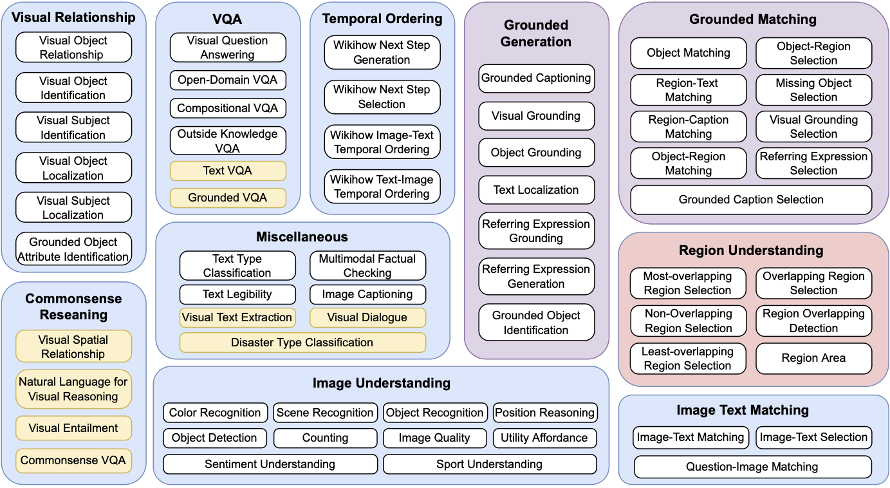

## MULTIINSTRUCT: Improving Multi-Modal Zero-Shot Learning via Instruction Tuning

This is the official repo for our ACL 2023 MULTIINSTRUCT [paper](https://arxiv.org/pdf/2212.10773.pdf). MULTIINSTRUCT is the first multimodal instruction tuning benchmark dataset that consists of 62 diverse multimodal tasks in a unified seq-to-seq format covering 10 broad categories. The tasks are derived from 21 existing open-source datasets and each task is equipped with 5 expert-written instructions.



## Call For Datasets:  :bulb: 
<!--   * [Call for Datasets] Call for new datasets <br> -->
We are actively seeking new datasets to incorporate into MultiInstruct. If there are particular datasets you wish to use that are currently not included in MultiInstruct, we encourage you to inform us by raising an issue. We are here to assist in crafting downloading scripts, preprocessing scripts, and comprehensive instructions, subsequently integrating these datasets into the repository.


## MultiInstruct 1.0 Release 🎉 
<!--   * [Dataset Release] June 2023, released **MultiInstruct 1.0** <br> -->
We are delighted to present MultiInstruct 1.0, the release of our first multimodal instruction tuning benchmark dataset. This dataset comprises 62 diverse multimodal tasks. MultiInstruct 1.0 is the version referenced and used in our published [paper](https://arxiv.org/pdf/2212.10773.pdf).

## Future Dataset Release: MultiInstruct 1.5 Coming in July 2023 :rocket: 
As we continue to advance our dataset, we are thrilled to share our plans for the release of MultiInstruct 1.5. In this upgraded version, we aim to release approximately 150 additional multimodal tasks, extending beyond the original 62 tasks, to further stimulate research in vision-language foundation models. These new tasks, all revolving around vision-language challenges, will be presented in a unified seq-to-seq format.

<!--   > If you have interesting datasets and you want us to include them in MultiInstruct, please let us know by raising issues. We will help you to write downloading scripts, preprocessing scripts, and instructions and include the datasets in the repo.

If you have interesting datasets and you want us to include them in MultiInstruct, please let us know by raising issues. We will help you to write downloading scripts, preprocessing scripts, and instructions and include the datasets in the repo.

  * [Upcoming Dataset Release] July 2023, will release **MultiInstruct 1.5** <br>
  > In the 1.5 version, we plan to release around 150 more multimodal tasks in addition to the original 62 tasks to facilitate research in vision-language foundation models. The new tasks are all vision-language tasks in a unified seq-to-seq format. -->
## Usage
### Downloading Dataset:
```
sh download_data.sh
```
This script helps you to download most of the datasets automatically. For some of the datasets, due to the license issue, we can not help you to automatically download them but you can manually download them by following the instructions [here](download_scripts).

### Preprocessing Dataset:
```
sh process_data.sh 1000 100
```
This script helps you to process all the datasets. The number "10000" is the max number of training instances for each task and "100" is the max number of validation instances for each task. You can change them based on your requirement. The processed data is stored in the training_data and testing_data directories.

### Assembling Dataset:
```
python build_dataset.py
```
This script helps you to assemble the instances randomly with 1 of their 5 instructions and generate the training and testing dataset (train.jsonl and test.jsonl). An example instance in the dataset looks like
```
{"unique_id": "mscoco_text_legibility_287140", "image_source": "coco2014", "task_name": "text_legibility", "image_path": "raw_datasets/MSCOCO2014/train2014/COCO_train2014_000000287140.jpg", "region": ["212.35294117647058 108.67088607594941 238.16806722689077 125.88607594936713"], "options": ["not clear and complete", "clear"], "target_txt": "clear", "prompt": "Decide if the text in the given region is legible. Region 212.35294117647058 108.67088607594941 238.16806722689077 125.88607594936713 \n\n[Options]: not clear and complete||||clear", "target": "clear"}
```
You can load the image via "image_path" and your input prompt is in the "prompt" field. The output is in the "target" field. You can ignore all other fields in each instance.


## Citation 
If you're using MultiInstruct in your research or applications, please cite using this BibTeX:
```BibTeX
@misc{xu2023multiinstruct,
      title={MultiInstruct: Improving Multi-Modal Zero-Shot Learning via Instruction Tuning}, 
      author={Zhiyang Xu and Ying Shen and Lifu Huang},
      year={2023},
      eprint={2212.10773},
      archivePrefix={arXiv},
      primaryClass={cs.CL}
}
```
## Question
If you face any problems when processing the dataset, please don't hesitate to contact us at zhiyangx@vt.edu. We will get back to you as soon as possible.
## License
Please carefully check the licenses for all the datasets in MultiInstruct on their official websites.
